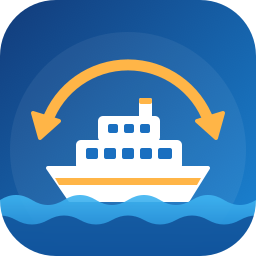
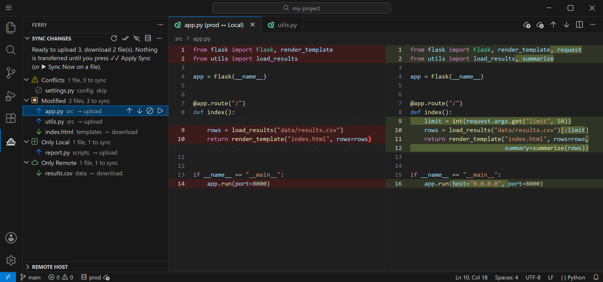
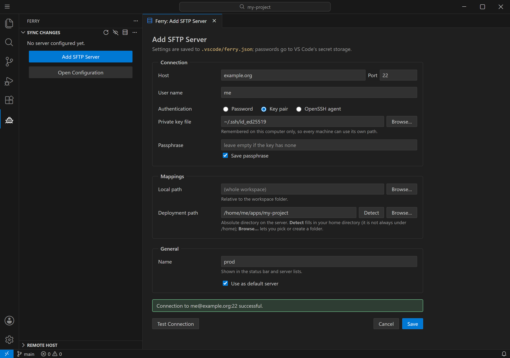
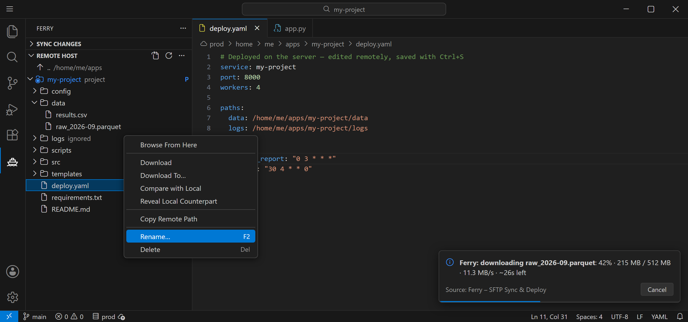

<p align="center">
  
</p>

<h1 align="center">Ferry – SFTP Sync &amp; Deploy</h1>

<p align="center">
  <b>PyCharm-style deployment for VS Code.</b><br>
  Compare your project with a server, review every diff, pick the direction per file, and upload on save.
</p>

<p align="center">
  <a href="https://marketplace.visualstudio.com/items?itemName=davtax.ferry"></a>
  <a href="https://marketplace.visualstudio.com/items?itemName=davtax.ferry"></a>
  
</p>



## Why Ferry?

Most SFTP extensions just push files. Ferry first shows you **what is different**, on both sides, and lets you decide:

- 🔍 **See before you sync.** Every difference is listed and grouped, and one click opens a diff.
- ↕️ **Choose the direction per file.** Upload, download, skip or delete, for each file or a whole group.
- 🧠 **Smart suggestions.** Ferry remembers the last sync, so it knows which side changed and flags real conflicts.
- 🛡️ **Safe by default.** Nothing is transferred until you press **Apply**. Deleted files are never brought back on their own. Downloads never leave half-written files.
- 💾 **Upload on save**, with a warning if someone changed the file on the server in the meantime.
- 🌐 **Browse and edit the server** directly from VS Code.

## Quick start

1. Install **Ferry** from the Marketplace (`ext install davtax.ferry`).
2. Open your project and click the **Ferry** icon in the activity bar.
3. Click **Add SFTP Server**, fill in the form, press **Test Connection**, then **Save**.
4. Click **Compare with Server** (⟳), review the list, adjust the arrows, and press **✓✓ Apply Sync**.



The form covers host, port, user, authentication (password, key pair or SSH agent) and the local ↔ deployment path mapping. **Detect** fills in your home directory on the server. **Browse…** lets you navigate the server and create folders. The deployment folder is created on the server if it does not exist yet. **Ferry: Edit Server…** opens the same form for an existing server.

## Features

### Sync Changes view

Ferry compares local files with remote files and groups them into **Conflicts**, **Modified**, **Only Local** and **Only Remote**.

- Click a file to open a **diff** (remote on the left, local on the right). You can edit the local side directly.
- Choose **↑ upload**, **↓ download** or **skip** for each file or group with the inline buttons. Files that exist on only one side (and their *Only Local* / *Only Remote* groups) also get a **🗑 delete** button: it deletes the file on the side where it still exists when you apply (local deletions go to the trash).
- The arrows only **set the direction**. Nothing is transferred until you press **✓✓ Apply Sync**, which runs all chosen actions, or **▶ Sync Now** on a single file or group. The message at the top of the panel always says what Apply will do. A `*` next to an action means you changed it from the suggested one.
- Hover a file to see the size and modification time of both sides, which side is newer, and exactly what the chosen action will do.

### Smart direction suggestions

Ferry remembers the size and modification time of both sides at the last sync:

| Situation | Suggestion |
|---|---|
| Only one side changed | Copy from that side |
| Both sides changed | **Conflict**, set to skip |
| Deleted locally since the last sync, unchanged on the server | **Delete on remote** |
| Deleted locally, but changed on the server since the last sync | Skip |
| Deleted on the server since the last sync | Skip (never restores or deletes local files on its own) |
| No sync history | The newer file wins; files of equal size are compared byte by byte |

### Remote Host view



- Browse the server and open remote files in a normal editor. Edit them and save (<kbd>Ctrl</kbd>+<kbd>S</kbd>, on macOS <kbd>⌘</kbd>+<kbd>S</kbd>) to write straight to the server. If the file changed on the server since you opened it, VS Code asks before overwriting.
- Right-click to **Rename** (<kbd>F2</kbd>), **Delete** (<kbd>Del</kbd>, on macOS <kbd>⌘</kbd>+<kbd>⌫</kbd>; with confirmation, works on multi-selections), create a **New File / New Folder**, **Upload Files Here**, **Download**, **Compare with Local**, **Copy Remote Path** or **Reveal Local Counterpart**.
- It starts in the project folder (marked **P**), but you can leave it: click the **..** row (or press <kbd>Alt</kbd>+<kbd>↑</kbd>, on macOS <kbd>⌥</kbd>+<kbd>↑</kbd>), **Go to Folder…** (absolute path or `~/…`), **Go to Home Directory**, or right-click a folder → **Browse From Here**. **Back to Project Folder** returns.
- **Open SSH Terminal** (terminal button in the view title, <kbd>Ctrl</kbd>+<kbd>Alt</kbd>+<kbd>`</kbd>, on macOS <kbd>⌘</kbd>+<kbd>⌥</kbd>+<kbd>`</kbd>) opens an integrated terminal on the server, already in the project folder. Right-click a folder to open it there instead. **Ferry: SSH to Server** is also listed in the terminal panel's **+** dropdown. It uses your system `ssh` client, so password prompts appear in the terminal.
- Outside the project, Compare and Download are hidden because those files have no local counterpart. Use **Download To…** to save one anywhere.

Keyboard shortcuts in the Remote Host view:

| Action | Windows / Linux | macOS |
|---|---|---|
| Save a remote file to the server | <kbd>Ctrl</kbd>+<kbd>S</kbd> | <kbd>⌘</kbd>+<kbd>S</kbd> |
| Rename | <kbd>F2</kbd> | <kbd>F2</kbd> |
| Delete | <kbd>Del</kbd> | <kbd>⌘</kbd>+<kbd>⌫</kbd> |
| Go up one folder | <kbd>Alt</kbd>+<kbd>↑</kbd> | <kbd>⌥</kbd>+<kbd>↑</kbd> |

### Progress you can trust

Transfers show a progress bar based on bytes, plus speed and time left, e.g. `42% · 215 MB / 512 MB · 11.3 MB/s · ~26s left · file 3/7`. **Cancel** stops the running transfer straight away. Downloads go into a temporary `.ferry-part` file that replaces the local file only when complete, so a cancelled or failed download never leaves a truncated file.

### And more

- **Several servers per project.** Pick the default one from the status bar or the **Select Default Server** button.
- **Upload on save.** Off by default. Turn it on from the status bar menu or with **Ferry: Toggle Upload on Save**.
- **Explorer and editor menus.** *Upload to Server*, *Download from Server*, *Compare with Deployed Version*, *Compare with Server* (on folders) and *Exclude from Sync*.
- **Ignore patterns** (gitignore syntax), combined from the `ferry.defaultIgnore` setting, `.ferryignore` in the mapped folder, each server's `ignore` list, and optionally `.gitignore`. **Manage Ignore Patterns** (eye icon) lets you pick files and folders in a dialog, add or remove patterns, or toggle `.gitignore`.

## Configuration

Settings are stored in `.vscode/ferry.json`, and VS Code autocompletes the file:

```jsonc
{
  "defaultServer": "prod",
  "uploadOnSave": true,
  "servers": [
    {
      "name": "prod",
      "host": "example.org",
      "port": 22,
      "username": "me",
      "auth": "key",                           // "password", "key" or "agent"
      "remotePath": "/home/me/project",
      "localPath": "",                         // subfolder of the workspace to map (default: the whole workspace)
      "ignore": ["data/", "*.sqlite"]
    }
  ]
}
```

Passwords and key passphrases are asked for on first connect and stored in VS Code's secret storage, not in the file. **Ferry: Forget Stored Password** clears them.

### Several computers (OneDrive, Dropbox, …)

`ferry.json` travels with the project, but some settings belong to each computer. These are kept in VS Code's storage on that computer instead:

- **Private key path.** With `"auth": "key"`, Ferry uses the key path saved on this computer, then `privateKeyPath` from `ferry.json` (if that file exists here), then `~/.ssh/id_ed25519`, `id_ecdsa`, `id_rsa`. If none exists, it asks once and remembers the choice.
- **Saved servers.** Every server you save (or find in a project's `ferry.json`) is remembered on this computer. In another project, **Add SFTP Server** offers them under **Saved servers** and fills in host, user, authentication, key and deployment path. **Forget** removes one.

## Settings

| Setting | Default | |
|---|---|---|
| `ferry.defaultIgnore` | `.git/`, `.vscode/`, `node_modules/`, `__pycache__/`, … | Patterns ignored for every server |
| `ferry.respectGitignore` | `false` | Also apply the root `.gitignore` |
| `ferry.compareMode` | `content` | `size` skips the byte comparison of files with equal size |
| `ferry.ignoreLineEndings` | `false` | Files that differ only in CRLF vs LF count as identical |
| `ferry.ignoreWhitespace` | `off` | `trailing`: ignore spaces at line ends and blank lines at the end; `amount`: also ignore how much whitespace (incl. indentation width) |
| `ferry.maxContentCompareSize` | 10 MB | Larger files are compared by size only |
| `ferry.concurrency` | 4 | Parallel SFTP operations |
| `ferry.uploadOnSaveCheckRemote` | `true` | Warn before upload on save overwrites a file that changed on the server |

## Limitations

- Only the first folder of a multi-root workspace is used.
- Remote symlinks to directories are not followed.
- Upload on save only reacts to saves made in VS Code. To pick up files changed by other tools, run **Compare with Server**.

## Development

```bash
npm install
npm run compile
npm test          # end-to-end test against an in-process SFTP server
npm run package   # builds ferry-x.y.z.vsix
```

Press <kbd>F5</kbd> in VS Code (on a Mac, <kbd>Fn</kbd>+<kbd>F5</kbd> if the top row controls brightness and volume) to start an Extension Development Host. To install the packaged extension, run `code --install-extension ferry-0.1.0.vsix`.

## License

[MIT](LICENSE)
